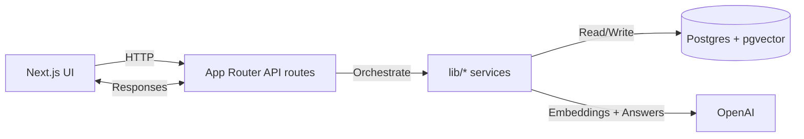

# Mixed-Source Research Dashboard

Mixed-Source Research is a Next.js workspace that unifies YouTube links and uploaded text files into a single, searchable knowledge base. It chunks content, generates embeddings, stores them in Postgres + pgvector, and answers questions with source-aware citations.

## Why this project

Research is usually split across videos, notes, transcripts, and documents. This project brings them together so you can:

- mix files and URLs in one shared context
- compare ideas across multiple sources
- surface patterns, contradictions, and overlaps
- ask grounded questions without manual searching

## Highlights

- YouTube imports with public transcripts
- Text file uploads: .txt, .md, .mdx, .csv, .json
- Unified chunking and embedding pipeline across sources
- Cross-source Q&A with citations and timestamps
- Source selection to narrow chat scope
- Connection insights across sources

## Quick Start

```bash
npm install
cp .env.example .env.local
npm run db:generate
npm run db:push
psql "$DATABASE_URL" -f prisma/init.sql
npm run dev
```

Open http://localhost:3000 and import YouTube links or upload text files.

## How it works

1. Add YouTube links or upload text files.
2. The app extracts and chunks content.
3. Embeddings are generated and stored in pgvector.
4. Questions are embedded and matched against stored chunks.
5. The LLM answers using only the retrieved evidence.

## Architecture



## Common use cases

- Research synthesis across videos, notes, and reports
- Financial analysis (earnings notes + commentary)
- Learning workflows (lectures + class notes)
- Personal knowledge management and second-brain setups

## Tech stack

- Next.js (App Router)
- TypeScript
- Prisma
- Postgres + pgvector
- OpenAI

## Setup

```bash
npm install
cp .env.example .env.local
npm run db:generate
npm run db:push
psql "$DATABASE_URL" -f prisma/init.sql
npm run dev
```

## Notes

- YouTube transcripts and uploaded files share the same retrieval system.
- If you update the Prisma schema, rerun `npm run db:generate` and `npm run db:push`.
- If the database predates the mixed-source upgrade, rerun `psql "$DATABASE_URL" -f prisma/init.sql` so both vector indexes exist.
- Current uploads target text-based formats; PDF and DOCX ingestion can be added next.
