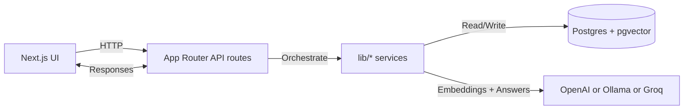

# ThinkMesh

<p align="center">
  
  
  
</p>

<h3 align="center">Turn videos and documents into one searchable reasoning workspace</h3>

<p align="center">
  ThinkMesh ingests YouTube transcripts and text files, stores embeddings in Postgres + pgvector,
  retrieves the most relevant chunks, and generates grounded answers through a multi-agent pipeline.
</p>

<p align="center">
  <a href="#the-problem">Problem</a> •
  <a href="#the-solution">Solution</a> •
  <a href="#key-features">Features</a> •
  <a href="#quick-start">Quick Start</a> •
  <a href="#architecture">Architecture</a> •
  <a href="#model-providers">Models</a> •
  <a href="#project-structure">Structure</a>
</p>

<p align="center">
  
  
  
  
  
  
  
</p>

---

## Overview

### The Problem

Knowledge work increasingly fragments across disparate sources—long-form videos, scattered notes, markdown documentation, exported datasets, and miscellaneous documents. Traditional single-source chat interfaces lack comprehensive context, while conventional RAG pipelines often reduce nuanced evidence into simplistic answers that fail to capture the full picture.

### The Solution

ThinkMesh addresses these challenges through a multi-source reasoning architecture:

- **Unified source ingestion** for YouTube transcripts and text-based files
- **Semantic embeddings** stored in a pgvector-backed retrieval layer with cross-source indexing
- **Top-k semantic search** across heterogeneous sources (videos and documents)
- **Multi-agent reasoning pipeline** with specialized thinkers and a larger judge model for answer synthesis
- **Source-grounded responses** with verifiable citations and timestamps anchored to original evidence

## Changelog

- **2026-04-06** — README refresh and architecture diagram updates
- **2026-04-03** — Unified ingestion pipeline for YouTube transcripts and text files

## Features

- **Multi-format ingestion** — YouTube transcripts and text uploads (.txt, .md, .mdx, .csv, .json)
- **Unified retrieval layer** — Cross-source semantic search via pgvector embeddings
- **Grounded Q&A** — Answers with citations, timestamps, and source references
- **Flexible source scoping** — Narrow queries to specific documents or videos
- **Cross-source insights** — Analyze connections and relationships across ingested material
- **Provider flexibility** — Switch between OpenAI, Ollama, and Groq without code changes

## Architecture



## Quick Start

### Prerequisites

- Node.js 18 or later
- PostgreSQL with pgvector extension enabled
- API credentials for at least one provider: OpenAI, Ollama, or Groq

### Installation

1. **Clone and install dependencies:**
   ```bash
   npm install
   ```

2. **Configure environment:**
   ```bash
   cp .env.example .env.local
   ```

3. **Initialize database:**
   ```bash
   npm run db:generate
   npm run db:push
   psql "$DATABASE_URL" -f prisma/init.sql
   ```

4. **Start development server:**
   ```bash
   npm run dev
   ```

5. **Access the application** at `http://localhost:3000` and begin importing YouTube links or uploading text files.

## Installation

### Database Setup

Create a dedicated database with vector support:

```sql
CREATE DATABASE thinkmesh;
\c thinkmesh
CREATE EXTENSION IF NOT EXISTS vector;
```

## Workflow

The application follows a structured pipeline for processing and retrieval:

1. **Ingestion** — Import YouTube links or upload text-based files
2. **Processing** — Content is automatically chunked and normalized
3. **Embedding** — Chunks are converted to semantic embeddings via configured provider
4. **Storage** — Embeddings are indexed and stored in pgvector for efficient retrieval
5. **Retrieval** — User queries are embedded and matched against stored chunks via semantic similarity
6. **Generation** — The LLM generates answers using only the retrieved evidence as context

## Model Configuration

### OpenAI

Configure the following environment variables for OpenAI API integration:

```bash
MODEL_PROVIDER="openai"
OPENAI_API_KEY="your_api_key"
OPENAI_CHAT_MODEL="gpt-4.1-mini"
OPENAI_EMBEDDING_MODEL="text-embedding-3-small"
```

### Ollama (Local)

For local, privacy-preserving inference, pull the desired models:

```bash
ollama pull llama3.1:8b
ollama pull nomic-embed-text
```

Configure with:

```bash
MODEL_PROVIDER="ollama"
OLLAMA_BASE_URL="http://127.0.0.1:11434"
OLLAMA_CHAT_MODEL="llama3.1:8b"
OLLAMA_EMBEDDING_MODEL="nomic-embed-text"
```

### Groq (Cloud)

Groq provides fast text generation via OpenAI-compatible API. Since embeddings are required for retrieval, configure both a generation and embedding provider:

**Option A: Groq for generation + OpenAI for embeddings**

```bash
MODEL_PROVIDER="groq"
EMBEDDING_PROVIDER="openai"
GROQ_API_KEY="your_groq_key"
GROQ_BASE_URL="https://api.groq.com/openai/v1"
GROQ_CHAT_MODEL="openai/gpt-oss-20b"
OPENAI_API_KEY="your_openai_key"
OPENAI_EMBEDDING_MODEL="text-embedding-3-small"
```

**Option B: Groq for generation + Ollama for embeddings**

```bash
MODEL_PROVIDER="groq"
EMBEDDING_PROVIDER="ollama"
GROQ_API_KEY="your_groq_key"
GROQ_CHAT_MODEL="openai/gpt-oss-20b"
OLLAMA_BASE_URL="http://127.0.0.1:11434"
OLLAMA_EMBEDDING_MODEL="nomic-embed-text"
```

## Project Structure

```
app/
├── page.tsx                    # UI entry point and client-side state
├── api/
│   ├── chat/route.ts          # Q&A orchestration endpoint
│   ├── connections/route.ts    # Cross-source relationship discovery
│   ├── videos/route.ts         # Video ingestion management
│   ├── videos/[id]/route.ts    # Individual video operations
│   ├── videos/import/route.ts  # Batch YouTube import
│   └── files/import/route.ts   # File upload processing
│
lib/
├── chat.ts                    # Core retrieval + answer generation pipeline
├── ingest.ts                  # Unified ingestion orchestrator
├── youtube.ts                 # YouTube transcript and metadata extraction
├── chunking.ts                # Text splitting and normalization
├── embeddings.ts              # Provider-agnostic embedding generation
├── vector-store.ts            # pgvector search and index operations
├── summarize.ts               # Document summarization and grounding
├── db.ts                      # Prisma ORM client
├── types.ts                   # Shared TypeScript definitions
├── workspace.ts               # Multi-workspace management
├── env.ts                     # Environment variable configuration
├── llm.ts                     # LLM provider abstraction
├── openai.ts                  # OpenAI-specific integrations
├── connections.ts             # Cross-source linking
└── documents.ts               # Document metadata and operations
│
prisma/
├── schema.prisma              # Data model (videos, documents, embeddings)
└── init.sql                   # Vector index initialization
```

## Technology Stack

| Layer | Technology |
|-------|-----------|
| **Frontend** | Next.js 15, TypeScript, React |
| **Backend** | Next.js App Router, Node.js |
| **Database** | PostgreSQL with pgvector extension |
| **ORM** | Prisma |
| **LLM Providers** | OpenAI, Ollama, Groq |
| **Vector Search** | pgvector |
| **Type Safety** | TypeScript (strict mode) |

## License

Licensed under the Apache License, Version 2.0. See [LICENSE](LICENSE) and [NOTICE](NOTICE).

## Important Notes

- **Unified retrieval** — YouTube transcripts and uploaded documents share the same pgvector-backed search layer, enabling cross-source queries.
- **Flexible generation** — The `MODEL_PROVIDER` environment variable controls the LLM backend without requiring code changes.
- **Flexible embeddings** — The `EMBEDDING_PROVIDER` variable independently controls embeddings generation, allowing hybrid configurations (e.g., Groq generation + OpenAI embeddings).
- **Schema management** — After modifying `prisma/schema.prisma`, run `npm run db:generate` and `npm run db:push` to update the database.
- **Migration from v0** — If upgrading from a single-source version, execute `psql "$DATABASE_URL" -f prisma/init.sql` to ensure all vector indexes are properly initialized.
- **Supported formats** — Current implementation supports: .txt, .md, .mdx, .csv, .json. PDF and DOCX ingestion planned for future releases.
- **Rate limiting** — Respect API rate limits for OpenAI and Groq. Ollama deployments have no rate limits.
