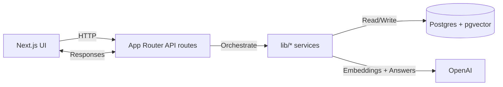

# Mixed-Source Research Dashboard

Mixed-Source Research is a Next.js workspace that unifies YouTube links and uploaded text files into a single, searchable knowledge base. It chunks content, generates embeddings, stores them in Postgres + pgvector, and answers questions with source-aware citations.

## Table of Contents

- News
- Key Features
- Architecture
- Quick Start
- Install
- Usage
- Project Structure
- Tech Stack
- Notes

## News

- 2026-04-06 Mixed-source README refresh and architecture diagram
- 2026-04-03 Added unified ingestion for YouTube and text files

## Key Features

- YouTube imports with public transcripts
- Text file uploads: .txt, .md, .mdx, .csv, .json
- Unified chunking and embedding pipeline across sources
- Cross-source Q&A with citations and timestamps
- Source selection to narrow chat scope
- Connection insights across sources

## Architecture



## Quick Start

```bash
npm install
cp .env.example .env.local
npm run db:generate
npm run db:push
psql "$DATABASE_URL" -f prisma/init.sql
npm run dev
```

Open http://localhost:3000 and import YouTube links or upload text files.

## Install

### Prerequisites

- Node.js 18+
- Postgres with pgvector enabled

### Database setup

```sql
CREATE DATABASE yt_rag;
\c yt_rag
CREATE EXTENSION IF NOT EXISTS vector;
```

## Usage

1. Add YouTube links or upload text files.
2. The app extracts and chunks content.
3. Embeddings are generated and stored in pgvector.
4. Questions are embedded and matched against stored chunks.
5. The LLM answers using only the retrieved evidence.

## Project Structure

```
app/
	page.tsx              # UI and client-side actions
	api/
		chat/route.ts       # Q&A orchestrator
		connections/route.ts
		videos/route.ts
		videos/[id]/route.ts
		videos/import/route.ts
lib/
	chat.ts               # Retrieval + answer pipeline
	ingest.ts             # YouTube + file ingestion pipeline
	youtube.ts            # Transcript + metadata fetch
	chunking.ts           # Chunking logic
	embeddings.ts         # Embedding generation
	vector-store.ts       # pgvector search and upserts
	summarize.ts          # Summaries and grounded answers
	db.ts                 # Prisma client
prisma/
	schema.prisma         # Data model
```

## Tech Stack

- Next.js (App Router)
- TypeScript
- Prisma
- Postgres + pgvector
- OpenAI

## Notes

- YouTube transcripts and uploaded files share the same retrieval system.
- If you update the Prisma schema, rerun `npm run db:generate` and `npm run db:push`.
- If the database predates the mixed-source upgrade, rerun `psql "$DATABASE_URL" -f prisma/init.sql` so both vector indexes exist.
- Current uploads target text-based formats; PDF and DOCX ingestion can be added next.
