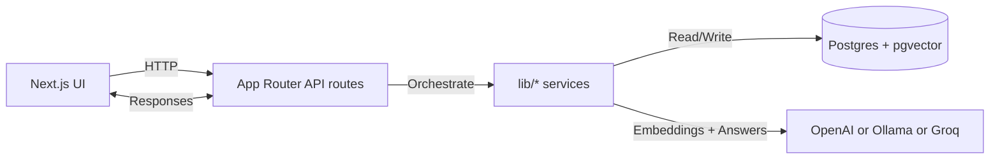

# ThinkMesh

<p align="center">
  
  
  
</p>

<h3 align="center">Turn videos and documents into one searchable reasoning workspace</h3>

<p align="center">
  ThinkMesh ingests YouTube transcripts and text files, stores embeddings in Postgres + pgvector,
  retrieves the most relevant chunks, and generates grounded answers through a multi-agent pipeline.
</p>

<p align="center">
  <a href="#the-problem">Problem</a> •
  <a href="#the-solution">Solution</a> •
  <a href="#key-features">Features</a> •
  <a href="#quick-start">Quick Start</a> •
  <a href="#architecture">Architecture</a> •
  <a href="#model-providers">Models</a> •
  <a href="#project-structure">Structure</a>
</p>

<p align="center">
  
  
  
  
  
  
  
</p>

---

## The Problem

Knowledge work gets fragmented fast. Important context lives across long videos, scattered notes, markdown files, exported datasets, and one-off documents. Traditional chat over a single source misses the bigger picture, while generic RAG pipelines often flatten nuanced evidence into one brittle answer.

ThinkMesh is built for the opposite workflow: collect mixed-source material, retrieve the strongest evidence, let multiple reasoning personas challenge the question from different angles, and produce a final judged answer grounded in the source text.

## The Solution

ThinkMesh combines:

- Source ingestion for YouTube transcripts and text-based files
- Chunking and embedding into a shared pgvector-backed retrieval layer
- Top-k semantic search across both videos and documents
- A multi-agent answer path with specialist thinkers and a larger judge model
- Source-aware responses that stay anchored to retrieved evidence

## News

- 2026-04-06 ThinkMesh README refresh and architecture diagram
- 2026-04-03 Added unified ingestion for YouTube and text files

## Key Features

- YouTube imports with public transcripts
- Text file uploads: .txt, .md, .mdx, .csv, .json
- Unified chunking and embedding pipeline across sources
- Cross-source Q&A with citations and timestamps
- Source selection to narrow chat scope
- Connection insights across sources
- Provider switching between OpenAI, Ollama, and Groq

## Architecture



## Quick Start

```bash
npm install
cp .env.example .env.local
npm run db:generate
npm run db:push
psql "$DATABASE_URL" -f prisma/init.sql
npm run dev
```

Open http://localhost:3000 and import YouTube links or upload text files.

## Install

### Prerequisites

- Node.js 18+
- Postgres with pgvector enabled
- Either OpenAI API access, a running Ollama instance, or Groq API access

### Database setup

```sql
CREATE DATABASE thinkmesh;
\c thinkmesh
CREATE EXTENSION IF NOT EXISTS vector;
```

## Usage

1. Add YouTube links or upload text files.
2. The app extracts and chunks content.
3. Embeddings are generated and stored in pgvector.
4. Questions are embedded and matched against stored chunks.
5. The LLM answers using only the retrieved evidence.

## Model providers

### OpenAI

Use these env settings:

```bash
MODEL_PROVIDER="openai"
OPENAI_API_KEY="your_key"
OPENAI_CHAT_MODEL="gpt-4.1-mini"
OPENAI_EMBEDDING_MODEL="text-embedding-3-small"
```

### Ollama

Start Ollama locally and pull the models you want:

```bash
ollama pull llama3.1:8b
ollama pull nomic-embed-text
```

Then use:

```bash
MODEL_PROVIDER="ollama"
OLLAMA_BASE_URL="http://127.0.0.1:11434"
OLLAMA_CHAT_MODEL="llama3.1:8b"
OLLAMA_EMBEDDING_MODEL="nomic-embed-text"
```

This lets the same ingestion and retrieval pipeline run on open-source local models.

### Groq

Groq is wired in for text generation through its OpenAI-compatible API. Since this app also needs embeddings for ingestion and retrieval, keep `EMBEDDING_PROVIDER` set to either `openai` or `ollama`.

Use:

```bash
MODEL_PROVIDER="groq"
EMBEDDING_PROVIDER="openai"
GROQ_API_KEY="your_key"
GROQ_BASE_URL="https://api.groq.com/openai/v1"
GROQ_CHAT_MODEL="openai/gpt-oss-20b"
OPENAI_API_KEY="your_openai_key"
OPENAI_EMBEDDING_MODEL="text-embedding-3-small"
```

Or with local embeddings:

```bash
MODEL_PROVIDER="groq"
EMBEDDING_PROVIDER="ollama"
GROQ_API_KEY="your_key"
GROQ_CHAT_MODEL="openai/gpt-oss-20b"
OLLAMA_BASE_URL="http://127.0.0.1:11434"
OLLAMA_EMBEDDING_MODEL="nomic-embed-text"
```

## Project Structure

```
app/
	page.tsx              # UI and client-side actions
	api/
		chat/route.ts       # Q&A orchestrator
		connections/route.ts
		videos/route.ts
		videos/[id]/route.ts
		videos/import/route.ts
lib/
	chat.ts               # Retrieval + answer pipeline
	ingest.ts             # YouTube + file ingestion pipeline
	youtube.ts            # Transcript + metadata fetch
	chunking.ts           # Chunking logic
	embeddings.ts         # Embedding generation
	vector-store.ts       # pgvector search and upserts
	summarize.ts          # Summaries and grounded answers
	db.ts                 # Prisma client
prisma/
	schema.prisma         # Data model
```

## Tech Stack

- Next.js (App Router)
- TypeScript
- Prisma
- Postgres + pgvector
- OpenAI
- Ollama
- Groq

## License

Licensed under the Apache License, Version 2.0. See [LICENSE](LICENSE) and [NOTICE](NOTICE).

## Notes

- YouTube transcripts and uploaded files share the same retrieval system.
- Generation backend is configurable through `MODEL_PROVIDER`.
- Embedding backend is configurable through `EMBEDDING_PROVIDER`.
- If you update the Prisma schema, rerun `npm run db:generate` and `npm run db:push`.
- If the database predates the mixed-source upgrade, rerun `psql "$DATABASE_URL" -f prisma/init.sql` so both vector indexes exist.
- Current uploads target text-based formats; PDF and DOCX ingestion can be added next.
